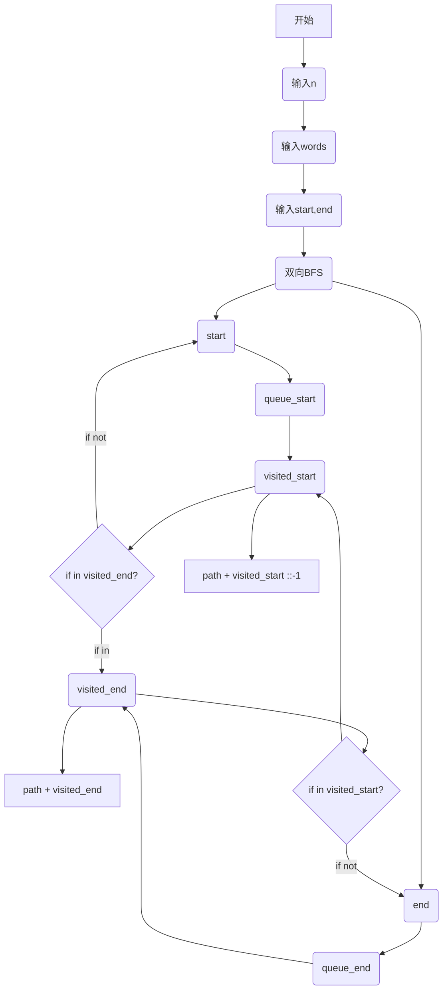

# Assignment #9: 图论：遍历，及 树算

Updated 1739 GMT+8 Apr 14, 2024

2024 spring, Complied by ==陈奕好 工学院==


**说明：**

1）请把每个题目解题思路（可选），源码Python, 或者C++（已经在Codeforces/Openjudge上AC），截图（包含Accepted），填写到下面作业模版中（推荐使用 typora https://typoraio.cn ，或者用word）。AC 或者没有AC，都请标上每个题目大致花费时间。

2）提交时候先提交pdf文件，再把md或者doc文件上传到右侧“作业评论”。Canvas需要有同学清晰头像、提交文件有pdf、"作业评论"区有上传的md或者doc附件。

3）如果不能在截止前提交作业，请写明原因。


**编程环境**

==（请改为同学的操作系统、编程环境等）==

操作系统：macOS Sonoma 14.4 (23E214)

Python编程环境：PyCharm 2023.3.1 (Professional Edition)


## 1. 题目

### 04081: 树的转换

http://cs101.openjudge.cn/dsapre/04081/


思路：flag存储的是当前在当下节点之前层数的最大深度，


代码

```python
def calculate_height(s):
    flag = [0]*10002  # 标记数组
    level, pre, post = 0, 0, 0  # 当前层数、最大层数、最大深度
    for char in s:  # 遍历字符串
        if char == "u":  # 如果字符为'u'
            level -= 1  # 层数减1
            flag[level] += 1  # 标记数组对应位置加1
        else:  # 如果字符为'd'
            level += 1  # 层数加1
            flag[level] = flag[level-1] + 1  # 标记数组对应位置等于上一层的标记数加1
            pre = max(level, pre)  # 更新最大层数
            post = max(post, flag[level])  # 更新最大深度
    return pre, post


s = input()  # 读取输入
pre, post = calculate_height(s)
print(f'{pre} => {post}')


```


代码运行截图 ==（至少包含有"Accepted"）==


### 08581: 扩展二叉树

http://cs101.openjudge.cn/dsapre/08581/


思路：一颗满二叉树


代码

```python
class TreeNode:
    def __init__(self, x):
        self.v = x
        self.l = None
        self.r = None


index = 0


def tree_build(pre_order):
    global index
    if index >= len(pre_order) or pre_order[index] == ".":
        index += 1
        return None

    root = TreeNode(pre_order[index])
    index += 1
    root.l = tree_build(pre_order)
    root.r = tree_build(pre_order)
    return root


def midOrder(root):
    if root is None:
        return ''
    return midOrder(root.l) + root.v + midOrder(root.r)


def postOrder(root):
    if root is None:
        return ''
    return postOrder(root.l) + postOrder(root.r) + root.v


tree = input()
root = tree_build(tree)
print(midOrder(root))
print(postOrder(root))

```


代码运行截图 ==（至少包含有"Accepted"）==


### 22067: 快速堆猪

http://cs101.openjudge.cn/practice/22067/


思路：三次实现


代码

```python
"""
class pig_stack():
    def __init__(self):
        self.stack = []

    def push(self, new):
        self.stack.append(new)

    def pop(self):
        if self.stack:
            self.stack.pop()

    def min(self):
        if len(self.stack):
            return min(self.stack)
        return False


stack1 = pig_stack()
while True:
    try:
        opt = list(map(str, input().split()))
        if opt[0] == 'push':
            stack1.push(int(opt[1]))
        elif opt[0] == 'pop':
            stack1.pop()
        elif opt[0] == 'min':
            if stack1.min():
                print(stack1.min())
    except EOFError:
        break
"""


"""
stack = []
minValue = []
while True:
    try:
        opt = list(map(str, input().split()))
        if opt[0] == 'push':
            x = int(opt[1])
            if minValue:
                if minValue[-1] >= x:
                    minValue.append(x)
            else:
                minValue.append(x)
            stack.append(x)
        elif opt[0] == 'pop':
            if stack:
                if stack[-1] == minValue[-1]:
                    minValue.pop()
                stack.pop()
        elif opt[0] == 'min':
            if stack:
                print(minValue[-1])
    except EOFError:
        break
"""


stack = []
m_list = []
while True:
    try:
        opt = input().split()
        if opt[0] == "pop":
           if stack:
                out_ = stack.pop()
                if m_list[-1] == out_:
                    m_list.pop()
                # print(out)

        elif opt[0] == "min":
            if stack:
                print(m_list[-1])

        else:
            in_ = int(opt[1])
            stack.append(in_)
            if m_list:
                if in_ <= m_list[-1]:
                    m_list.append(in_)
            else:
                m_list.append(in_)

    except EOFError:
        break


```


代码运行截图 ==（AC代码截图，至少包含有"Accepted"）==


### 04123: 马走日

dfs, http://cs101.openjudge.cn/practice/04123


思路：dfs


代码

```python
T = int(input())
dir = [(2, 1), (1, 2), (-1, 2), (-2, 1), (-2, -1), (-1, -2), (1, -2), (2, -1)]


def valid(x, y, n, m):
    return 0 <= x < n and 0 <= y < m


def dfs(x, y, n, m, visited, count):
    if count == n * m:  # 看是否自我湮灭
        return 1
    total = 0
    visited[x][y] = True
    for dx, dy in dir:
        nx, ny = x + dx, y + dy  # 举棋子
        if valid(nx, ny, n, m) and not visited[nx][ny]:
            total += dfs(nx, ny, n, m, visited, count + 1)  # 放棋子
    visited[x][y] = False  # 回溯
    return total


for _ in range(T):
    n, m, x, y = map(int, input().split())
    visited = [[False]*m for _ in range(n)]
    print(dfs(x, y, n, m, visited, 1))


```


代码运行截图 ==（AC代码截图，至少包含有"Accepted"）==


### 28046: 词梯

bfs, http://cs101.openjudge.cn/practice/28046/


思路：这个代码很直观，就是数据存储时犯了难，在copilot帮助下学习了双向BFS，以及对队列自我湮灭有了更深刻的理解。

流程图




代码

```python
from collections import defaultdict, deque


def visit_vertex(queue, visited, other_visited, graph):
    word, path = queue.popleft()
    for i in range(len(word)):
        pattern = word[:i] + '_' + word[i + 1:]
        for next_word in graph[pattern]:
            if next_word in other_visited:
                return path + other_visited[next_word][::-1]
            if next_word not in visited:
                visited[next_word] = path + [next_word]
                queue.append((next_word, path + [next_word]))


def word_ladder(words, start, end):
    graph = defaultdict(list)
    for word in words:
        for i in range(len(word)):
            pattern = word[:i] + '_' + word[i + 1:]
            graph[pattern].append(word)

    queue_start = deque([(start, [start])])
    queue_end = deque([(end, [end])])
    visited_start = {start: [start]}
    visited_end = {end: [end]}

    while queue_start and queue_end:
        result = visit_vertex(queue_start, visited_start, visited_end, graph)
        if result:
            return ' '.join(result)
        result = visit_vertex(queue_end, visited_end, visited_start, graph)
        if result:
            return ' '.join(result[::-1])

    return 'NO'


n = int(input())
words = [input() for i in range(n)]
start, end = input().split()
print(word_ladder(words, start, end))


```


代码运行截图 ==（AC代码截图，至少包含有"Accepted"）==


### 28050: 骑士周游

dfs, http://cs101.openjudge.cn/practice/28050/


思路：get_degree 这个小剪枝很好！

第二版加了个lru_cache，感觉大一点的数据估计出生点在中间（？，还是说受边界的影响较小，提升并不明显。

代码

```python
from functools import lru_cache

# initializing
size = int(input())
matrix = [[False]*size for i in range(size)]
x, y = map(int, input().split())
dir = [(2, 1), (1, 2), (-1, 2), (-2, 1), (-2, -1), (-1, -2), (1, -2), (2, -1)]


def valid(x, y):
    return 0 <= x < size and 0 <= y < size and not matrix[x][y]


def get_degree(x, y):
    count = 0
    for dx, dy in dir:
        nx, ny = x + dx, y + dy
        if valid(nx, ny):
            count += 1
    return count


@lru_cache(maxsize = 1<<30)
def dfs(x, y, count):
    if count == size**2:
        return True

    matrix[x][y] = True

    next_moves = [(dx, dy) for dx, dy in dir if valid(x + dx, y + dy)]
    next_moves.sort(key=lambda move: get_degree(x + move[0], y + move[1]))

    for dx, dy in next_moves:
        if dfs(x + dx, y + dy, count + 1):
            return True

    matrix[x][y] = False
    return False

if dfs(x, y, 1):
    print("success")
else:
    print("fail")


```


代码运行截图 ==（AC代码截图，至少包含有"Accepted"）==


## 2. 学习总结和收获

==如果作业题目简单，有否额外练习题目，比如：OJ“2024spring每日选做”、CF、LeetCode、洛谷等网站题目。==

在补每日选坐了，再不补就补不完了。


